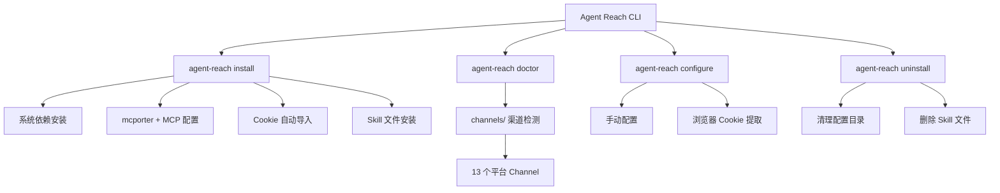

# Agent Reach - AI Agent 互联网能力扩展工具

> 更新时间：2026-03-05 10:47:46Z

## 项目愿景

Agent Reach 是一个 Python CLI 工具，给 AI Agent 装上互联网能力，让 Agent 可以搜索和读取 10+ 主流平台（Twitter/X、YouTube、Reddit、GitHub、B站、小红书、抖音、LinkedIn、Boss直聘、微信公众号等）。

## 架构总览



## 核心模块结构

| 模块 | 路径 | 职责 |
|------|------|------|
| **CLI** | `agent_reach/cli.py` | 命令行入口，包含 install/doctor/configure/uninstall 等命令 |
| **配置** | `agent_reach/config.py` | YAML 配置文件管理，存储 Token/Cookie |
| **诊断** | `agent_reach/doctor.py` | 渠道健康检查，汇总所有 Channel 状态 |
| **核心** | `agent_reach/core.py` | AgentReach 类封装，提供 doctor 接口 |
| **Cookie** | `agent_reach/cookie_extract.py` | 浏览器 Cookie 自动提取 |
| **渠道** | `agent_reach/channels/` | 13 个平台渠道实现 |

## 支持的平台（Channel 列表）

### Tier 0 - 装好即用（无需配置）
- **Web** (`web.py`) - 任意网页通过 Jina Reader 读取
- **YouTube** (`youtube.py`) - 视频信息和字幕提取
- **GitHub** (`github.py`) - 仓库和代码搜索
- **RSS** (`rss.py`) - RSS/Atom 订阅解析

### Tier 1 - 需要免费 Key/MCP
- **Twitter** (`twitter.py`) - xreach CLI + Cookie
- **Reddit** (`reddit.py`) - JSON API + 代理
- **Exa Search** (`exa_search.py`) - mcporter + Exa MCP

### Tier 2 - 需要配置
- **B站** (`bilibili.py`) - yt-dlp + Cookie/代理
- **小红书** (`xiaohongshu.py`) - mcporter + xiaohongshu-mcp
- **抖音** (`douyin.py`) - mcporter + douyin-mcp-server
- **LinkedIn** (`linkedin.py`) - linkedin-scraper-mcp
- **Boss直聘** (`bosszhipin.py`) - mcp-bosszp
- **微信公众号** (`wechat.py`) - Camoufox + miku_ai

## 入口与启动

### CLI 命令
```bash
agent-reach install --env=auto    # 一键安装
agent-reach doctor                # 检查渠道状态
agent-reach configure twitter-cookies "xxx"  # 配置
agent-reach uninstall             # 卸载
```

### Python API
```python
from agent_reach import AgentReach
from agent_reach.config import Config

config = Config()
agent = AgentReach(config)
results = agent.doctor()          # 检查所有渠道
print(agent.doctor_report())     # 格式化报告
```

## 关键依赖

### 核心依赖（pyproject.toml）
- `requests>=2.28` - HTTP 请求
- `feedparser>=6.0` - RSS 解析
- `pyyaml>=6.0` - 配置文件
- `rich>=13.0` - 富文本输出
- `yt-dlp>=2024.0` - 视频/字幕下载

### 可选依赖
- `playwright>=1.40` - 浏览器自动化
- `browser-cookie3>=0.19` - Cookie 提取
- `mcp[cli]>=1.0` - MCP 客户端

### 系统依赖（自动安装）
- `gh CLI` - GitHub CLI
- `Node.js 22` - npm 运行环境
- `xreach CLI` - Twitter 工具
- `mcporter` - MCP 工具

## 测试策略

测试文件位于 `tests/` 目录：
- `test_cli.py` - CLI 命令测试
- `test_config.py` - 配置管理测试
- `test_doctor.py` - 渠道检测测试
- `test_channels.py` - 渠道实现测试
- `test_core.py` - 核心模块测试
- `test_channel_contracts.py` - Channel 接口契约测试

运行测试：`pytest tests/`

## 编码规范

- **语言版本**: Python 3.10+
- **Linter**: ruff (target-version = py310, line-length = 100)
- **类型检查**: mypy (python_version = 3.10)
- **代码风格**: E, F, I 规则（忽略 E501）

## AI 使用指引

### 安装新渠道
1. 运行 `agent-reach doctor` 查看渠道状态
2. 根据输出提示安装依赖/配置
3. 再次运行 `doctor` 验证

### 排查问题
```bash
agent-reach doctor              # 查看所有渠道状态
agent-reach watch               # 快速健康检查
agent-reach check-update        # 检查更新
```

### 常见任务
- 配置 Twitter Cookie: `agent-reach configure twitter-cookies "auth_token=xxx; ct0=yyy"`
- 配置代理: `agent-reach configure proxy http://user:pass@ip:port`
- 从浏览器导入: `agent-reach configure --from-browser chrome`

## 重要文件清单

| 文件 | 说明 |
|------|------|
| `pyproject.toml` | 项目配置和依赖 |
| `agent_reach/cli.py` | CLI 入口（约 1200 行） |
| `agent_reach/config.py` | 配置管理 |
| `agent_reach/doctor.py` | 渠道诊断 |
| `agent_reach/channels/base.py` | Channel 基类 |
| `agent_reach/skill/SKILL.md` | Agent Skill 指南 |
| `tests/test_*.py` | 6 个测试文件 |

### 深度补捞 - Channel 后端详情

| Channel | 后端 | 配置要求 |
|---------|------|----------|
| **B站** | yt-dlp | 可选代理 BILIBILI_PROXY |
| **抖音** | douyin-mcp-server | 需要 mcporter + douyin-mcp-server |
| **LinkedIn** | linkedin-scraper-mcp, Jina Reader | 需要 mcporter 配置 |
| **Boss直聘** | mcp-bosszp, Jina Reader | 需要 mcp-bosszp |
| **微信公众号** | camoufox, miku_ai | camoufox 阅读 + miku_ai 搜索 |

---

## 变更记录

### 2026-03-05 10:47:46Z - 深度补捞
- 完成 100% 文档覆盖率
- 新读取 channel 文件：bilibili.py, douyin.py, linkedin.py, bosszhipin.py, wechat.py
- 新读取测试文件：test_channels.py, test_channel_contracts.py
- 更新 index.json 覆盖率为 100%

### 2026-03-05 - 初始化
- 创建 CLAUDE.md 文档
- 完成 98%+ 文档覆盖率
- 识别 13 个平台渠道模块
